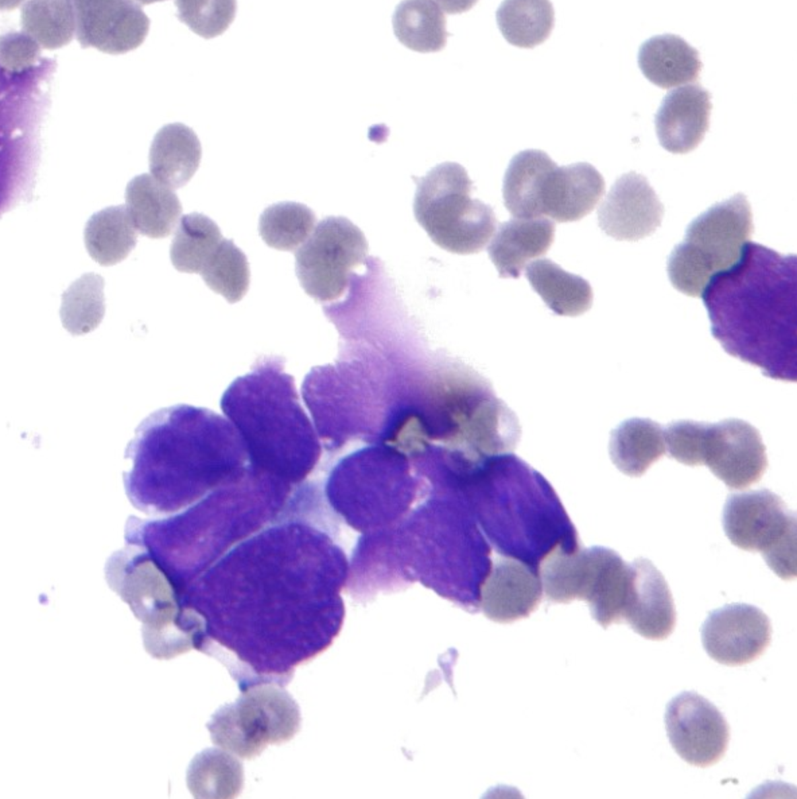

--- 
title: "Breast Canser"
author: "Wang Ruiqi"
date: "`r Sys.Date()`"
site: bookdown::bookdown_site
---

# Proposal
 

## Breast Cancer Data
[The original dataset link](https://archive.ics.uci.edu/ml/datasets/Breast+Cancer)

### Describtion 

This is one of three domains provided by the Oncology Institute that has repeatedly appeared in the machine learning literature. (See also lymphography and primary-tumor.)

This data set includes ***201 instances*** of one class and ***85 instances*** of another class.  The instances are described by 9 attributes, some of which are linear and some are nominal. 

###  Attribute Information

* **Class:** no-recurrence-events, recurrence-events
* **age:** 10-19, 20-29, 30-39, 40-49, 50-59, 60-69, 70-79, 80-89, 90-99.
* **menopause:** lt40, ge40, premeno.
* **tumor-size:** 0-4, 5-9, 10-14, 15-19, 20-24, 25-29, 30-34, 35-39, 40-44, 45-49, 50-54, 55-59.
* **inv-nodes:** 0-2, 3-5, 6-8, 9-11, 12-14, 15-17, 18-20, 21-23, 24-26, 27-29, 30-32, 33-35, 36-39.
* **node-caps:** yes, no.
* **deg-malig:** 1, 2, 3.
* **breast:** left, right.
* **breast-quad:** left-up, left-low, right-up,	right-low, central.
* **irradiat:8**	yes, no.

## The modeling goal
To predict if there is a breast cancer recurrence based on features age,tumor-size, inv-nodes...

## The models for using
* Logistic Regression
* KNN
* Decision tree
* Random forest.